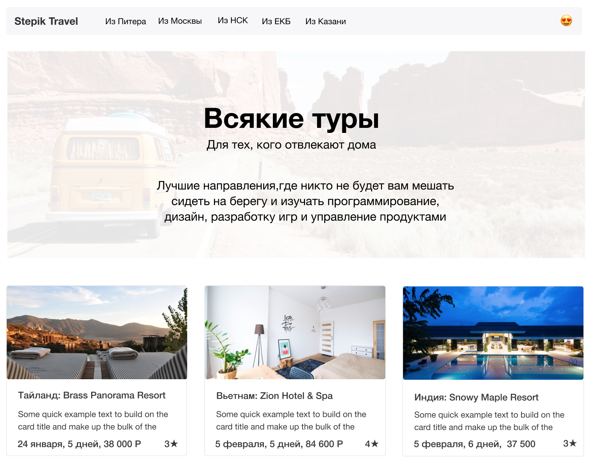
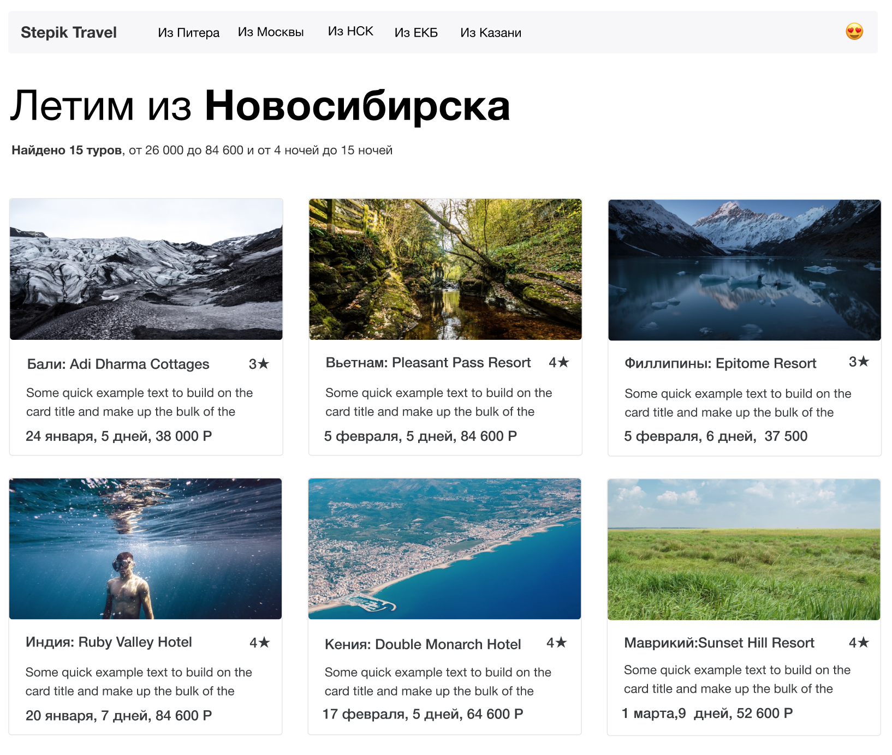
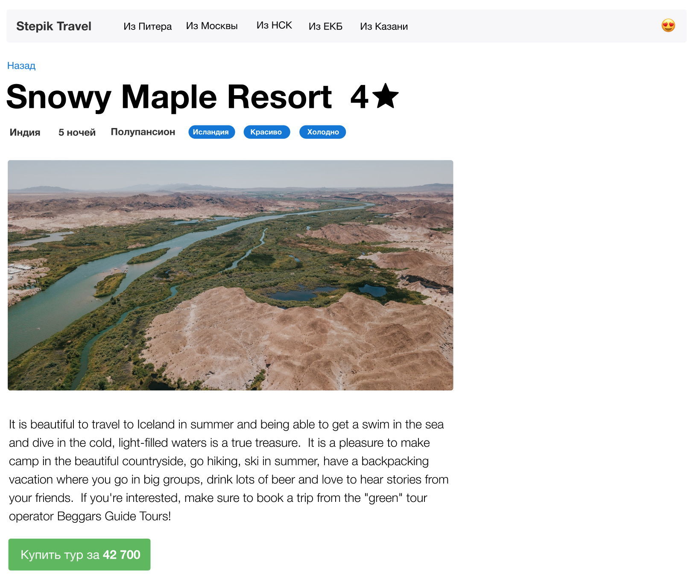

```
========================
Author: Zinoviy PROTSYNA
Date: 28 April 2020
========================
```

# Content
- [How to run project](#how-to-run-project)
- [Project overview](#project-overview)
- [Additional information](#additional-information)
- [Project steps](#project-steps)
---


# How to run project

1. Create virtual environment 

   example:

   `$ virtualenv --python==python3.6 venv`

1. Activate virtual environment 

   example:

   `$ source venv/bin/activate`

1. Install libraries from file `requirements.txt`

   `(venv) $ pip install -r requirements.txt`

1. If need You can add env variable from .env file

   See example in file `.env.example`

   `export $(grep -v '^#' .env | xargs)`
   
   If Yoy want - You can check export .env file:
   
   `env | grep DJANGO`

1. Run project

   `(venv) $ python stepik_tours/manage.py runserver 8000`

1. Test on browser
    
    Open next urls:
    - [Main page](http://localhost:8000/)
    - [Departure page](http://localhost:8000/departure/msk)
    - [Tour page](http://localhost:8000/tour/1)

1. When this project is running - You can run tests from test/test.py
 
   In other console (need library **requests**):

   `$ python test/test.py`

   If all is well, then you will get this answer:
   
   ```
   ----------------------------------------------------------------------
   Ran 6 tests in 0.040s
   
   OK
   ```
   ---

1. You can check code with flake8 (* for Developers)

   `(venv) $ flake8 stepik_tours/`
    
   and
    
   `(venv) $ flake8 test/`

# Project overview

#### Краткое описание проекта (общее для первого и второго модуля)

В первых двух модулях нужно выполнить проект сайта про путешествия (проект по бронированию туров).

Верстка и готовый набор данных для этого проекта предоставляются.

#### Главная страница

В меню выводится список направлений, при клике на направление мы переходим на страницу направления.

Заголовок, подзаголовок и описание нужно будет вывести на первом экране.

Рекомендуемые предложения выводятся в цикле, у каждого указывается картинка, название, дата, описание, цена.
При клике на карточку мы переходим на страницу тура.



#### Список по направлению

На странице направления выводится заголовок.

Для получения данных нужно отфильтровать все туры, оставив только те, у которых destination=destination.

В подзаголовке выводится количество найденного, максимальные и минимальные значения.

Найденные предложения выводятся в цикле, у каждого указывается картинка, название, дата, описание, цена.
При клике на карточку мы переходим на страницу тура.



#### Страница тура

Выведите в заголовке название локации и количество звезд.

Выведите в подзаголовке страну, длительность.

Выведите изображение, описание.

Добавьте кнопку, которая будет вести в ваши личные сообщения или на гугл-форму или на сторонний сайт.



---


# Additional information

[Посмотрите макеты проекта здесь: https://academy.stepik.org/flask-projects](https://academy.stepik.org/flask-projects)

Скачайте исходники для верстки здесь:
- http://www.cssdesk.com/zHL6n
- http://www.cssdesk.com/gmmUZ
- http://www.cssdesk.com/pQqan

Получите данные здесь (опционально):
https://github.com/kushedow/flask-html/blob/master/Project%201/data.py

---


# Project steps

#### 0. Начните работу над проектом.
- Создайте новое виртуальное окружение
- Установите **Django**
- Создайте новый проект с названием `stepik_tours`
- Создайте приложение `tours`
- Перейдите в файл настроек и измените `ALLOWED_HOSTS` и `INSTALLED_APPS`

#### 1. Создайте представления (view) для 3 страниц:

- главной `MainView`
- направления `DepartureView`
- тура `TourView`
 
#### 2. Распишите роуты и сопоставьте им представления

- главной `/` – `MainView`
- направлению `/departure/<str:departure>` – `DepartureView`
- тура `/tour/<int:id>/` – `TourView`

Не забудьте импортировать файл с представлениями вашего приложения

#### 3. Скопируйте шаблоны в папку templates:

- `index.html` главной
- `departure.html` направления
- `tour.html` тура

#### 3. Выведите нужный шаблон для каждого представления:

- `index.html` для `MainView`
- `departure.html` для `DepartureView`
- `tour.html` для `TourView`

#### 4. Проверьте качество своего кода

Библиотека **flake8** проверит ваш код на соответствие стайлгайдам и стандарту pep8 

Установите библиотеку **flake8**

```
(venv) $ pip install flake8
```

Запустить ее можно с помощью команды (в конце – точка!)

```
(venv) $ flake8 .
```

Исправьте те ошибки, которые нашел у вас в коде **flake8**.

Прохождение вашим кодом проверки без ошибок – обязательное условие сдачи вашего проекта.

#### 5. Опубликуйте проект и отправьте ссылку:

Добавьте файл `requirements.txt` с помощью

```
(venv) $ pip freeze > requirements.txt
```

#### 6. Загрузите результаты работы на GitHub

Создайте новый репозиторий на **[GitHub.com](https://github.com/)**, загрузите туда все файлы своего проекта любым способом (вы можете сделать коммит, используя командную строку, редактор кода или просто перетащить файлы в окошко браузера)

Скопируйте ссылку на репозиторий в поле ниже и отправьте решение на проверку!
